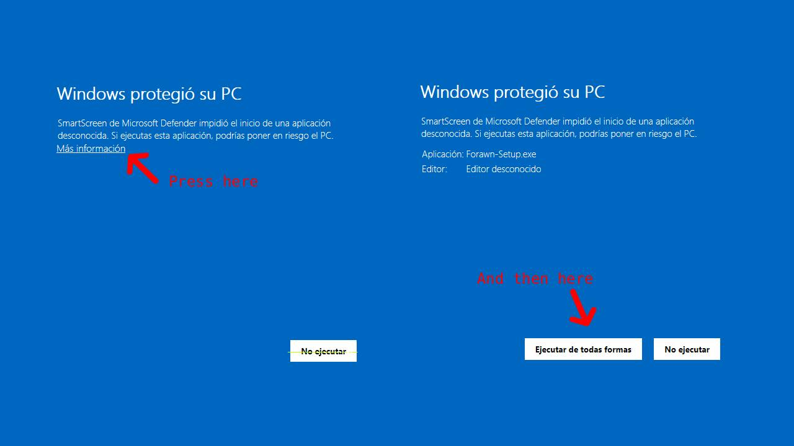

# 📝 Forawn

**Forawn** is a modular and multilingual application for taking notes on Windows, designed to offer clarity, speed, and customization. Built with Flutter and SQLite, it provides a refined experience for organizing notes, managing categories, and accessing powerful tools such as music downloading, image generation, NSFW search, and translation.

---

## 🚀 Features

### Core Note System
- Create, edit, archive, and delete notes
- Pin important notes to the top
- Organize with categories and search
- Attach images to notes
- Undo/redo actions and confirmation dialogs
- Fully localized interface with multi-language support

### Bonus Tools
- 🎧 **Spotify music downloader** with YouTube fallback
- 🖼️ **AI image generator** for creative visuals
- 🌐 **Text translator** with multi-language support
- 📄 **QR Generator**
- 🚫 **NSFW content search** (disabled by default for safety)

---

## 📦 Installation

Download the latest installer from the [Releases](https://github.com/Frantt21/forawn/releases) page.

### 🛡️ If Windows shows you this alert

- This happens because the installer is not signed (without capital)

### 📁 Default install location:

- C:\Users\YourName\AppData\Roaming\Forawn
- This avoids permission issues and allows the app to run without administrator privileges.

### Requirements
- Windows 10 or later (64-bit)
- No admin privileges needed

---

## 🛠️ Technologies Used

- **Flutter** (Windows desktop)
- **SQLite** (local database)
- **Inno Setup** (installer packaging)
- **Path Provider** for safe file storage
- **Custom localization system** with editable language files

---

## 📬 Feedback & Contributions

Do not hesitate to report errors and ideas that can help in the development progress of Forawn. If you want to contact me, you can do so through Discord: @frntts

---

## 📜 License

This project is licensed under the terms of the [LICENSE.txt](LICENSE.txt) file included in the repository.

---
